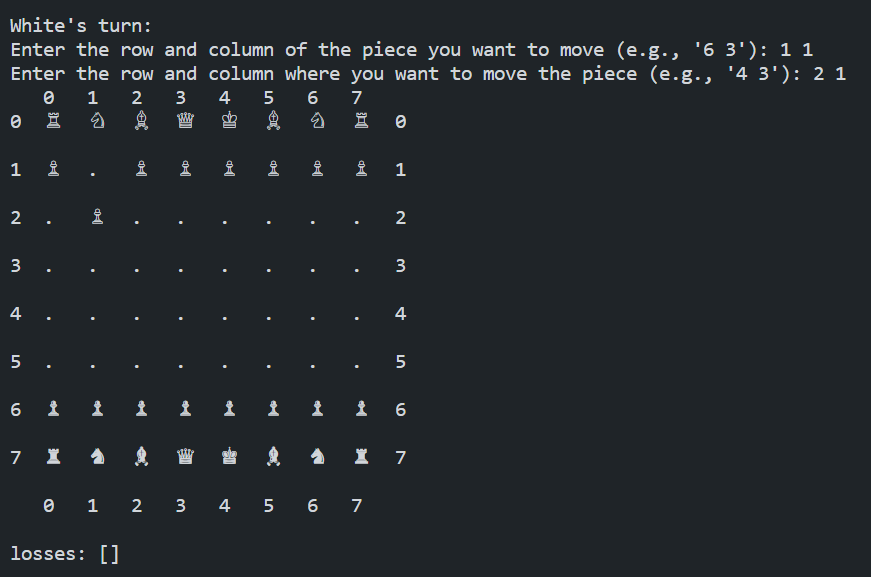

# Chess Game
This is a simple implementation of the game of chess in Python. It allows two players to take turns making moves on a standard 8x8 chess board until one player is in checkmate.

## Getting Started
To run the game, simply run the game.py file in your Python environment. The game will prompt each player to enter their moves in turn, and will validate the moves to ensure they are legal.

## Game Rules
The game follows standard chess rules, with the exception of en passant and castling. These features may be added in a future version.

## Code Structure
The code is structured into three modules: pieces.py, chessboard.py and game.py. 
 * The pieces.py module defines the different chessboard pieces as entities with their actions as properties. 
 * The chessboard.py module develops the environment, the chess board, with the pieces as agents. 
 * Finally, the game.py file defines the rules of the gameplay, ties everything down and runs the gaming loop.

## Contributing
Contributions are welcome! If you find a bug or have a feature request, please open an issue on GitHub. If you would like to contribute code, please fork the repository and submit a pull request.